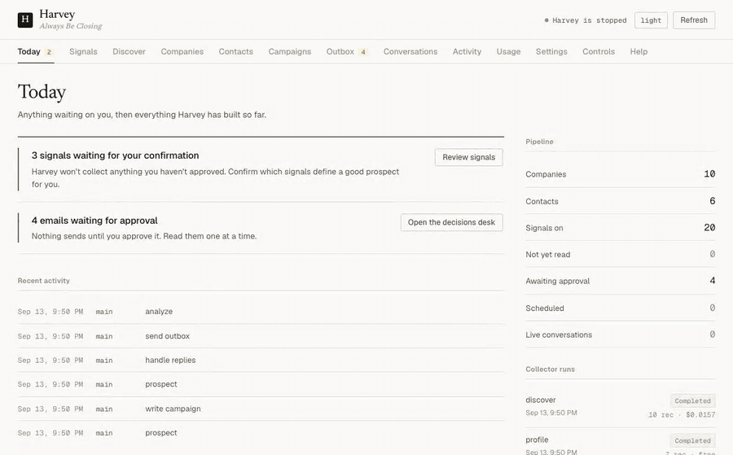

# Harvey 💼

<p align="center">
  <a href="https://github.com/authrain-cloud-abdullahformuli/harvey/blob/main/LICENSE"></a>
  <a href="https://www.python.org/"></a>
  <a href="https://github.com/authrain-cloud-abdullahformuli"></a>
  <a href="https://github.com/authrain-cloud-abdullahformuli/harvey/actions"></a>
  <a href="https://github.com/authrain-cloud-abdullahformuli/harvey/stargazers"></a>
</p>

**An autonomous sales agent that runs on your Claude Code subscription.**

Harvey finds businesses worth selling to, learns something specific about each one, writes cold email that references it, sends it, reads the replies, and works the conversation toward a meeting. It runs on your machine, in a loop, on its own.

The unusual part: **there is no API bill.** Harvey drives the `claude` CLI in headless mode, so every decision, every email, every reply it handles is billed against the Claude Pro or Max subscription you already pay for. Not an API key. Not per-token. The subscription.

```
$ harvey run

============================================================
Harvey is online. Always Be Closing.
============================================================
Checking pipeline state...
Decision: prospect (only 3 new prospects; pipeline needs leads)
  discover  → 41 businesses in Portland, OR       ($0.00, OpenStreetMap)
  profile   → 41 sites read, 288 observations     (free, no model calls)
  scout     → 12 scored against your ICP
Decision: write_campaign (12 new prospects with no drafts)
  writer    → 3-email sequence for Cascade Landscaping
  outbox    → 12 emails waiting for your approval
Cycle complete. Sleeping for 15 minutes.
```

And the dashboard it keeps, at `localhost:5555` — confirming a signal, building a
cohort out of the confirmed ones, pricing a discovery run before it spends
anything, and approving mail one message at a time:



---

## Table of contents

- [Why the subscription thing matters](#why-the-subscription-thing-matters)
- [What Harvey actually does](#what-harvey-actually-does)
- [Quick start](#quick-start)
- [You confirm what it looks for](#you-confirm-what-it-looks-for)
- [The prospecting pipeline](#the-prospecting-pipeline)
- [The skills library](#the-skills-library)
- [The sub-agents](#the-sub-agents)
- [Nothing sends without you](#nothing-sends-without-you)
- [The dashboard](#the-dashboard)
- [How the data is stored](#how-the-data-is-stored)
- [Configuration](#configuration)
- [Legal and deliverability](#legal-and-deliverability)
- [Troubleshooting](#troubleshooting)
- [Project structure](#project-structure)
- [Philosophy](#philosophy)
- [Roadmap](#roadmap)

---

## Why the subscription thing matters

Every other autonomous sales agent bills you per token. That is the whole reason they cost what they cost: an agent that thinks in a loop, all day, is an agent that burns API credits in a loop, all day. Vendors solve this by thinking less — shorter prompts, cheaper models, fewer passes.

Harvey sidesteps it. It shells out to the `claude` CLI:

```python
claude -p "<prompt>" --output-format json --dangerously-skip-permissions
```

That is the same subscription-billed path `claude` uses interactively. So Harvey can afford to think properly: full skills library in context, careful personalization per prospect, real reply handling.

**What this costs you:**

| | |
|---|---|
| Claude Pro or Max | you already pay for it |
| Finding businesses | **$0** on the default source, or ~$0.37 per 1,000 on the cheapest paid one |
| Reading their websites | **$0** — three HTTP requests each, no model call |
| Writing and sending | your subscription + a mailbox (~$7/mo Google Workspace) |
| Prospecting tools | **none.** No Apollo, no ZoomInfo, no Clearbit, no Clay. |

For comparison, the tools Harvey replaces start at $250–500/month — and they are weakest precisely where Harvey is strongest: small local businesses with 5–50 people, where single-provider contact coverage caps out around 30% and micro-businesses are frequently absent entirely.

**Harvey also budgets itself.** It reads your live subscription quota the same way `/usage` does, and throttles so it always leaves headroom for your own interactive Claude work. Set `max_daily_claude_percent: 80` and Harvey will stop before it starts costing you your own rate limit.

> **Honest caveat.** Running an agent against a subscription is a grey area worth understanding for yourself. Anthropic's terms permit personal automation of your own account; they prohibit reselling access or sharing credentials. Harvey runs locally as you, with your login. Don't turn it into a service for other people.

---

## What Harvey actually does

Harvey runs a heartbeat: wake up, check the budget, decide what most needs doing, do it, log it, sleep. Every 15 minutes by default.

```
                 ┌──────────────────────────────────────┐
                 ↓                                      │
   Wake  →  Quiet hours?  →  Budget OK?  →  Decide  →  Act  →  Log  →  Sleep
                 │               │
              (sleep)         (sleep)
```

It decides deterministically, not by asking Claude what to do — that would burn a call on something derivable from four counts:

```
handle replies  >  send campaigns  >  write campaigns  >  prospect  >  idle (analyze)
```

Profiling and outbox draining ride along on **every** cycle regardless, because they cost nothing and have to happen on schedule.

---

## Quick start

### Prerequisites

- **Python 3.11+** — check with `python3 --version`. macOS ships 3.9; if that's what you have, `brew install python@3.13` first.
- An active **Claude Pro or Max** subscription, with the CLI logged in (`claude login`)
- A mailbox to send from — Gmail/Workspace recommended, on a *dedicated secondary domain*

### Easiest: let Claude set it up

```bash
git clone https://github.com/authrain-cloud-abdullahformuli/harvey.git
cd harvey
claude
```

Then say: **"set up Harvey for me"**. The repo ships a `CLAUDE.md` that turns Claude Code into the setup wizard — it checks what state you're in, installs what's missing, asks what it needs, and trains Harvey on your product.

### Or do it yourself

```bash
# 1. Install — note python3.13, not python3. On macOS bare `python3` is the
#    system 3.9, and a venv built from it can't run Harvey.
python3.13 -m venv .venv && source .venv/bin/activate && pip install -e .

# 2. Configure — every variable is documented inline with where to get it
cp .env.example .env && $EDITOR .env

# 3. Learn your product from your website
harvey train https://your-company.com

# 4. Choose what makes a good prospect (see below — this one matters)
harvey signals --confirm free

# 5. Find businesses. Free source, no account needed.
harvey discover

# 6. Watch it work
harvey dashboard          # http://localhost:5555
harvey run
```

---

## You confirm what it looks for

This is the part that makes Harvey different from a black box, and it is deliberately not skippable.

Harvey knows how to collect **23 signals** about a business. It does not collect any of them until you say so. On first run it *proposes* the catalog; you confirm, skip, or reject each one in the dashboard or from the terminal:

```bash
harvey signals                       # review the catalog
harvey signals --confirm free        # everything that costs nothing (21 of them)
harvey signals --confirm SERP_RANK   # a paid one, opted into explicitly
```

Every signal shows what it is in plain language, **what it costs**, and how many companies already carry it.

| | Signal | What it tells you |
|---|---|---|
| **Discovery** | `SERP_RANK` | Where they rank for their own core search. Positions 11–30 are the sweet spot: visible enough to be trying, and losing. |
| | `NO_WEBSITE` | They have a listing and a phone and no site. If you sell websites, the highest-intent signal that exists. |
| | `UNCLAIMED_LISTING` | Nobody has claimed their Google Business Profile. |
| | `REVIEW_RATING` / `REVIEW_COUNT` | Good but invisible, or visible but struggling. |
| **Profile** | `INCUMBENT_AGENCY` | Who currently has the account, credited in their own footer. Every detection builds a roster you can target as a whole book of business. |
| | `RUNNING_GOOGLE_ADS` / `RUNNING_META_ADS` | They are spending on acquisition *today*. The strongest budget signal available for free. |
| | `NO_ONLINE_BOOKING` | Leads have to phone in, so after-hours demand is lost. |
| | `NO_SCHEMA_MARKUP` | A concrete, checkable SEO gap you can name in an email. |
| | `BLOG_STALE` | Content marketing started and abandoned. |
| | `SITE_PAGE_COUNT`, `TECH_STACK`, `BLOCKS_AI_CRAWLERS`, `HIRING_ROLE` | Size, platform, AI-search visibility, and what they're hiring for. |
| **People** | `CONTACT_FOUND`, `DECISION_MAKER_TITLE`, `LIKELY_OWNER`, `REGISTRY_VERIFIED` | Who decides, and whether they own the place. |
| **Contact** | `EMAIL_PATTERN`, `EMAIL_STATUS`, `CONTACT_FORM_URL` | Whether you can actually reach them. |

### Then a cohort is a query, not a list

Once signals are confirmed, the dashboard's cohort builder turns them into a target set — pick what a good prospect **must have** and what **disqualifies** them, and it counts the matches live:

```
Has a marketing agency  AND  running Google Ads  AND NOT  already has online booking
→ 23 companies
```

That is a campaign with a reason behind it. You know exactly why each of those 23 is on the list, and so does the email Harvey writes them.

---

## The prospecting pipeline

Four stages. Each one runs independently, re-runs safely, and states its cost.

### 1. DISCOVER — who exists

The only stage that spends money, so it always estimates first and never calls anything until you press go.

```bash
harvey discover --providers   # the menu, with real prices
harvey discover --estimate    # projected spend, then exits
harvey discover               # go
```

| Source | Cost | Free tier | Best for |
|---|---|---|---|
| **OpenStreetMap** *(default)* | free | unlimited, no account | Trying the whole pipeline before paying anyone. Coverage is thin for businesses without a storefront: OSM maps premises, so whole trades are barely present (under 2,000 roofers and under 2,300 plumbers in the entire US). Harvey says so in the UI rather than quietly under-delivering. |
| **DataForSEO Business Listings** | $0.372 / 1,000 | $1 credit | Local trades, clinics, contractors. Phone, domain, rating, claimed status — and it can filter for businesses with **no website at all**. |
| **DataForSEO SERP** | $0.0018 / search | $1 credit + free sandbox | Rank as the buying signal. |
| **Serper** | ~$0.30–1.00 / 1,000 | 2,500 free, no card | The easiest paid one to try. |

Cities geocode themselves (cached forever, one lookup each). Directories, aggregators and institutions are filtered by pattern, not a blocklist — `en.wikipedia.org` and `biz.yelp.com` never make it in.

> **Depth 20–30, not 100.** Google removed 100-results-per-page in September 2025, so depth 100 is now billed as ten pages nearly everywhere. Below rank 30 it is mostly directories anyway.

### 2. PROFILE — what they are

**Free.** Three HTTP requests per business. No browser, no model call. This is the highest value-per-effort stage in the whole system, because it produces the facts that make an email specific.

Homepage, `robots.txt`, `sitemap.xml`, plus the team and careers pages when they exist — then regex over HTML already in hand. Out comes the incumbent agency, the ad pixels, the missing schema, the abandoned blog, the open roles, the named humans.

Agency detection is the compounding one. Almost every agency credits itself in the footer, and Harvey scores the wording: *"Powered by"* / *"Website by"* → 0.9 confidence; a bare descriptive link → 0.75; an unlabelled link → 0.35 and **not recorded**. A wrong incumbent in an email is worse than saying nothing.

### 3. ENRICH — who decides

Free public registries first. Name plus title from the team page, confirmed against an authoritative registry where one exists — which also filters out your own parsing artifacts, because a "person" who matches nothing usually wasn't one.

### 4. VERIFY — can you reach them

Harvey learns each company's **address pattern** and verifies one candidate, rather than brute-forcing name variations. Raw SMTP probing is not viable from a laptop — outbound port 25 is usually blocked, and Google Workspace and Microsoft 365 accept everything from an unknown IP.

Every address is tagged honestly: `verified` / `risky` (catch-all) / `guess` / `invalid`. **Only deliverable ones are ever sent to.** A guess is never treated as a win.

> Harvey is worth running even if you never let it send. `harvey export` writes a sequencer-ready CSV of everything it found.

---

## The skills library

Harvey's sales knowledge lives in `skills/` as **plain Markdown you can edit**. There is no fine-tuning, no vector store, no retrieval step. Before an agent runs, the skills it needs are concatenated straight into its prompt. Change a file, and the next heartbeat behaves differently — no restart, no code change.

This is the main way you shape Harvey. If its emails are too pushy, edit `email_frameworks.md`. If it mishandles a specific objection, edit `objection_handling.md` and add the response you'd actually give.

### What ships

**`email_frameworks.md`** — 301 lines, the most important file in the repo. Opens with the only rule that matters: *write like a real person sending a real email.* Contains a hard ban list on AI tells (no "I hope this finds you well", no "I wanted to reach out", no "circling back"), compliance rules that override every style rule beneath them, 2026 reply-rate data on length and cadence and why link tracking hurts you, and five frameworks — **AIDA, PAS, BAB, QVC, 3Ps** — with selection rules for when each one fits.

**`signal_playbook.md`** — How to turn a signal into the first line of an email. Which signal wins when a company has several. How to reference something you observed without sounding like you ran a scan on them.

**`objection_handling.md`** — The **LAARC** loop (Listen → Acknowledge → Assess → Respond → Confirm) with worked responses across the four objection families: budget, authority, need, timing. The framing throughout is that you are not "overcoming" an objection, you are finding out what the actual concern is.

**`lead_qualification.md`** — **BANT** for the first screen, ICP scoring 1–10 for prioritization, **MEDDIC** for anything complex. Includes explicit disqualification criteria, which matter more than the qualification ones.

**`sales_methodology.md`** — The operating philosophy: the ABC loop, how a conversation should flow across stages, tone calibration, and the ethical lines Harvey does not cross.

**`offer_strategy.md`** — The offer ladder by engagement level, and the rule that governs it: *never lead with an offer, never pitch in a cold email.* First contact exists to start a conversation. Offers come out only after genuine interest.

**`prospecting_tactics.md`** — Search operators, company-website mining, trigger events, referral paths. Finding people without paying for a database.

**`account_navigation.md`** — Companies versus contacts, multi-threading rules, which door to knock on first when a company has several.

**`linkedin_outreach.md`** — Connection sequences and rate limits, opening with the risk section it should open with: automating LinkedIn violates their ToS, never use a fake identity, and if someone asks whether this is automated, say yes immediately.

**Generated for your product by `harvey train <url>`:**

- **`product_knowledge.md`** — what you sell, the benefits, pricing, use cases, the pain you solve, buying triggers
- **`competitive_intel.md`** — battle cards per competitor, differentiation angles, migration paths

*(Both are gitignored. Your positioning and pricing shouldn't land in a public repo by accident.)*

### Which agent gets which

Defined in `harvey/brain.py` — edit the map to change it.

| Skill | Scout | Writer | Handler | Sender | LinkedIn |
|---|:-:|:-:|:-:|:-:|:-:|
| `prospecting_tactics` | ● | | | | ● |
| `lead_qualification` | ● | | | | |
| `account_navigation` | ● | | | | |
| `signal_playbook` | ● | ● | | | |
| `email_frameworks` | | ● | | ● | |
| `sales_methodology` | | ● | ● | | |
| `offer_strategy` | | ● | ● | | |
| `objection_handling` | | | ● | | |
| `linkedin_outreach` | | | | | ● |
| `product_knowledge` | ● | ● | ● | ● | ● |
| `competitive_intel` | | ● | ● | | |

Adding a skill: write the file, add its name to `skill_map` in `harvey/brain.py`. That's the whole process.

---

## The sub-agents

Harvey feels like one agent. Underneath it's five, each loaded with different skills.

| Agent | What it does |
|---|---|
| **Scout** | Scores and personalizes what the collectors found. Python does the searching and the email resolution; Claude is used only where judgment is actually needed — which is what keeps the token cost sane. |
| **Writer** | Generates 3-email sequences. Email 1 under 75 words, email 2 under 75, email 3 under 40. Hard ban list on AI-sounding language. |
| **Sender** | Renders merge variables per prospect and stages each email into the outbox with a send time. Drains due and approved items with human-like pacing, enforcing the daily cap and stop-on-reply. |
| **Handler** | Polls for replies, dedups them, classifies intent, advances the conversation stage, and queues responses through the same approval ladder. Detects bounces, marks the address invalid, cancels that prospect's queued sends, and trips a global kill switch past a bounce-rate threshold. |
| **Analyst** | Runs on idle cycles. Pipeline stats, campaign performance, intent distribution, what's actually working. |

Conversation stages: `initial_outreach → engaged → qualifying → presenting → negotiating → closing → closed_won / closed_lost`

---

## Nothing sends without you

By default **every outgoing email waits for your approval.** Harvey is a copilot until you decide otherwise.

The dashboard's Outbox is a decisions desk: one email fills the pane, the rest wait in a rail, and you work the queue with `A` approve, `R` reject, `J`/`K` to move. That shape is deliberate — a wall of stacked drafts invites a single approve-all reflex, which is exactly the review the approval ladder exists to force.

```bash
harvey outbox                 # review from the terminal
harvey outbox --approve-all
harvey sending pause          # kill switch, stops everything mid-flight
```

Before anything leaves, a **deterministic pre-send gate** — no model involved — rejects: unrendered merge tags, banned phrases, emails over the length cap, too many links, HTML bodies, non-deliverable addresses, and any mismatch between the recipient and the database record.

When you trust it, set `channels.email.require_approval: false` for full autopilot.

---

## The dashboard

```bash
harvey dashboard     # http://localhost:5555
```

Plain HTML, CSS and JavaScript served from `harvey/web/`. No build step, no framework, no bundler — edit `app.css` and reload. Fonts are vendored, so it renders correctly with the network off.

- **Today** — an asymmetric two-column screen: anything waiting on a decision down the left with the activity feed beneath it, and a rail carrying pipeline figures, collector runs and setup. It opens here rather than on a setup checklist, because the question you actually have is "is anything waiting on me?" Setup lives in the rail and disappears entirely once it's done.
- **Signals** — the confirmation gate and the cohort builder
- **Discover** — the provider menu with prices side by side, an estimate, then a run
- **Companies / Contacts** — everything found, with CSV export
- **Outbox** — the decisions desk
- **Conversations** — every reply and how Harvey handled it
- **Usage** — real Claude quota gauges and per-agent token counts. No dollar figures: you're on a subscription, you aren't billed per token, and pretending otherwise would be theater.

Three rules hold the interface together:

**The interface carries no colour.** The chrome is warm greyscale in both modes, so the only coloured thing on screen is status — if something has a hue, it means something.

**One status vocabulary.** Prospects, campaigns, conversations, the outbox, signals and email deliverability all resolve to the same five tones, so "waiting on you" looks identical wherever it appears.

**Every figure is monospaced and tabular**, so columns of numbers line up and a value changing doesn't shift the layout.

Appearance has three states, not two. `auto` follows your OS and is the default, so the dashboard matches the rest of your machine until you deliberately pick light or dark. Dark isn't a separate design — it's the same design re-tokenised.

---

## How the data is stored

SQLite at `data/harvey.db`. One idea drives the schema:

> **Every fact is a row, never a column.**

Not `companies.has_agency`. Not `companies.rank`. A row in `observations`:

```
observations(company_id, prospect_id, collector, signal_code,
             value_num, value_text, confidence, evidence_url, observed_at, run_id)
```

Four things fall out of that, none of which you get from columns:

1. **A new signal needs no migration.** A collector invents a code and it works.
2. **History is free.** The same signal observed quarterly *is* a time series — and "they dropped their agency last quarter" is a far better trigger than any static fact.
3. **Confidence and provenance travel with the fact** instead of being lost on overwrite. *"We think their agency is X, 0.9 confidence, here's the URL."*
4. **A cohort is a query.** Set intersection happens in SQL, not in application code over a capped fetch.

The vocabulary is governed: a database trigger rejects any `signal_code` not in the `signal_codes` table, so a typo fails loudly instead of quietly inventing a junk signal.

Other tables: `companies`, `prospects`, `campaigns`, `conversations`, `outbox`, `actions`, `runs`, `usage_events`, `email_patterns`, `settings`, `feedback`.

---

## Configuration

Two files, both plain text.

**`.env`** — credentials. Every variable documented inline with where to get it. The only required one is a mail provider; everything else is optional.

**`harvey.yaml`** — who Harvey is and who it sells to:

```yaml
persona:      { name, company, role, email, tone }
product:      { name, description, pricing, key_benefits, objection_responses, offer }
icp:          { industries, titles, company_size, geography, hiring_signals, geo_coordinates }
channels:
  email:      { provider: gmail | smtp | instantly, max_daily_sends, require_approval,
                send_to_risky, max_bounce_rate }
usage:        { max_daily_claude_percent, heartbeat_interval_minutes, quiet_hours }
```

If `harvey.local.yaml` exists it wins. It's gitignored, so a fork can carry real product configuration while the tracked `harvey.yaml` stays a template — nobody publishes their positioning and pricing by accident.

### Commands

```bash
harvey run                   # the heartbeat loop
harvey dashboard             # web UI at localhost:5555
harvey signals               # review/confirm what to prospect against
harvey discover              # find businesses; --providers / --estimate
harvey profile               # read discovered companies' sites (free)
harvey train <url>           # learn a product from its website
harvey status                # pipeline summary
harvey usage                 # Claude quota + per-agent tokens
harvey outbox                # review queued email
harvey export                # deliverable prospects → CSV
harvey sending pause|resume  # kill switch
harvey gmail auth            # one-time Gmail OAuth
```

---

## Legal and deliverability

Harvey automates outreach, but **you are the sender.** Cold email is legal in most places when done right and expensive when done wrong — CAN-SPAM penalties run to $53,088 per email. Harvey ships with compliant defaults. Keep them.

**CAN-SPAM (US).** Truthful subject line and accurate from-address — Harvey's copywriting rules forbid fake "re:" threads and impersonation. A working opt-out, honored fast: Harvey treats any opt-out wording as immediate and permanent. Your physical mailing address in the footer — configure this before your first campaign.

**GDPR / PECR (EU & UK).** B2B cold email needs a defensible legitimate interest: the pitch must be genuinely relevant to that person's role, you must know where the data came from, and objecting must be effortless. If you can't say why a specific person would care, Harvey shouldn't email them — and its qualification rules say so.

**Bot disclosure.** Some jurisdictions require disclosing automation. Harvey is instructed to answer truthfully, always, if a prospect asks whether they're talking to an AI. Never configure it otherwise.

**LinkedIn.** Browser automation violates LinkedIn's ToS and can get the account restricted. Off by default. If you turn it on, use an account you can afford to lose.

**Deliverability — warm up or burn out.** Sending cold email from your main domain, or at volume on day one, lands you in spam permanently.

1. Buy a **dedicated sending domain** (`getacme.com`, not `acme.com`).
2. Set up **SPF, DKIM and DMARC** on it. Without all three, Gmail junks you.
3. **Warm up for 2–4 weeks** before real volume.
4. **Ramp slowly** — 10–20/day per inbox, adding ~5/day. The `max_daily_sends: 50` default is a ceiling, not a target.
5. **Watch bounces.** Above ~3%, stop and fix list quality. Harvey trips its own kill switch past your configured threshold.

*None of this is legal advice. Sending at scale or into regulated industries? Talk to a lawyer.*

---

## Troubleshooting

**`command not found: harvey`** — `source .venv/bin/activate` first.

**`ModuleNotFoundError: No module named 'harvey'` after install (macOS)** — Python 3.13 silently ignores `.pth` files carrying the macOS hidden flag, and some Macs propagate that flag into `.venv`. Run `harvey install` again (it auto-fixes), or: `ln -s "$(pwd)/harvey" .venv/lib/python3.13/site-packages/harvey`

**`externally-managed-environment`** — Use a venv, not system Python.

**`SyntaxError` or odd `ImportError`s right after install (macOS)** — Your venv is Python 3.9. `python3 -m venv` builds from `/usr/bin/python3`, which macOS keeps at 3.9. Check with `.venv/bin/python -V`, then rebuild: `rm -rf .venv && python3.13 -m venv .venv && source .venv/bin/activate && pip install -e .`

**Claude headless mode fails** — `claude login`, and confirm the subscription is active. Test with `claude -p "say hi"`. In Docker, mount `~/.claude` into the container.

**Discovery finds nothing** — Confirm signals first (`harvey signals --confirm free`); nothing is collected until you do. If you're on the free OpenStreetMap source, it only covers mapped trades and is thin for service-area businesses — `harvey discover --providers` shows the alternatives.

**Overpass is throttling** — It's free volunteer infrastructure. Harvey walks three mirrors before giving up. Wait a few minutes, or use a paid provider for bulk work.

**Emails land in spam** — Almost always the domain, not the copy. Check SPF/DKIM/DMARC, confirm warmup ran, halve your volume.

**Harvey does nothing during the day** — Check `quiet_hours` and whether it hit `max_daily_claude_percent`. `harvey status` shows current state; the `actions` table logs every decision.

**How do I stop it right now?** — `Ctrl+C`, or `harvey sending pause` to stop outbound while leaving the loop running. State is in SQLite, so it resumes cleanly.

**Where does my data live?** — All local: `data/harvey.db`, `.env`, `harvey.yaml`. Nothing goes anywhere except the APIs you configured.

---

## Project structure

```
harvey/
├── main.py              # heartbeat loop
├── brain.py             # Claude CLI wrapper + skills loading + usage recording
├── state.py             # SQLite schema, migrations, observations, cohorts
├── signals.py           # the 23-signal catalog Harvey proposes
├── pipeline.py          # DISCOVER → PROFILE chaining
├── gate.py              # deterministic pre-send checks
├── dashboard.py         # FastAPI JSON API
├── collectors/
│   ├── discover.py      # provider adapters, junk filtering, entity resolution
│   └── profile.py       # the free HTTP profiler
├── agents/              # scout, writer, sender, handler, analyst
├── integrations/        # mail providers, email finder, quota
└── web/                 # dashboard HTML/CSS/JS — no build step

skills/                  # ← the sales knowledge. Editable Markdown.
prompts/                 # ← agent system prompts. Also editable Markdown.
tests/                   # 242 tests
```

---

## Philosophy

**Autonomous doesn't mean unsupervised.** Quiet hours, spend caps, send limits, an approval queue, a deterministic pre-send gate, and a kill switch. Harvey asks before it spends and before it sends, until you tell it not to.

**You decide what a good prospect is.** Harvey proposes signals; you confirm them. A prospect list you can't explain is a prospect list you shouldn't send to.

**If it can be gotten deterministically, don't use a model.** Rank position, tech detection, junk filtering, the priority decision, the pre-send gate — all plain code. Claude is reserved for the parts that genuinely need judgment. That's why this runs on a subscription at all.

**A failure is an observation, not silence.** "No team page found" is a finding. "Overpass is throttling" is a finding. Silent failures look exactly like clean results, which is how a broken run gets mistaken for an empty market.

**The database is the asset, not the agent.** The initial list is worth little. The same signals observed over quarters — who changed agencies, who started spending on ads, who let their content go stale — is worth a great deal.

**Everything is editable.** Prompts, skills, config, the dashboard. All plain text. You don't need to be a developer to change how Harvey sells.

---

## Roadmap

**Done:** heartbeat loop · observation data model with governed vocabulary · user-confirmed signal catalog · cohort builder · discovery provider menu with cost estimates · free HTTP profiler with agency detection · pattern-first email finding with honest status · native mail providers (Gmail API, SMTP+IMAP) · outbox approval ladder · deterministic pre-send gate · bounce detection and kill switch · reply handling with intent classification · subscription quota tracking · website trainer · web dashboard · CSV export

**Next:** people enrichment from public registries · consent-gated voice callbacks · calendar integration for auto-booking · scheduled re-observation so signal *changes* trigger outreach · multi-product support

> **On voice:** a fully autonomous AI cold dialer is not on this roadmap, and won't be. Under FCC 24-17 an AI-generated voice is an "artificial voice" under the TCPA, and 47 CFR 64.1200(a)(1) has no B2B exemption — penalties run $500–1,500 per call, uncapped, and some states ban it outright. Voice here will be **consent-gated**: inbound and opt-in-triggered callbacks only.

---

## Changelog

See [CHANGELOG.md](CHANGELOG.md). Current release: **0.2.0**.

---

## Author & Maintainers

- **Author & Maintainer:** **[Abdullah Formuli](https://github.com/authrain-cloud-abdullahformuli)** ([authrainmedia@gmail.com](mailto:authrainmedia@gmail.com))
- Standard open-source contribution guidelines in **[MAINTAINERS.md](MAINTAINERS.md)**.

---

## License

This software is released under the [MIT License](LICENSE). Copyright (c) 2026 Abdullah Formuli.

---

*"Put that coffee down. Coffee is for closers."* — Blake, *Glengarry Glen Ross*
